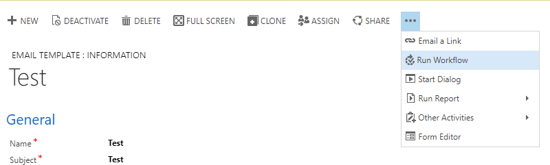

# Admin Guide

## Package Installation

- **(Required) [Communication Consent Adapter For Click Dimensions](https://chorussolutions.visualstudio.com/Charity%20CRM/_build?definitionId=343&view=buildsHistory) (Latest Version)**: Integrates the Communication Consent solution with Click Dimensions 
  - **(Required) [Workflow Libraries](https://chorussolutions.visualstudio.com/Charity%20CRM/_build?definitionId=78&view=buildsHistory) (Latest Version)**: Useful Generic Plugins that can be used as workflow activities. 
  - **(Required) [Click Dimensions](http://clickdimensions.com/) (8.1.1.0 <)**: Marketing solution for Microsoft Dynamics CRM. 
  - **(Required) [Communication Consent](https://chorussolutions.visualstudio.com/Charity%20CRM/_build?definitionId=294&view=buildsHistory) (Latest Version)**: Allows consent to be given by customers for GDPR.

## Configuration

*There is no configuration that can be performed on this solution.*

## Custom Integration

*There is no custom integration that can be configured on this solution.*

## Administration 

*There is no administration that can be performed on this solution.*

## Sercurity

*There are no security requirements for this solution.*

# User Guide

## Overview

A collection of workflows created to facilitate the automatic incrementation of the _Number of consent requests sent_ and _Last request sent on_. 

## Interface

*There are no interface changes for this solution.*

## Functionality

### Click Dimensions Adapter 

An adaptor has also been built for integration with Click Dimension. This adaptor has no relation to Click Dimensions so you should be able to update the software without any impact on this adaptor. The following will explain how to use this functionality, you will need to have a basic knowledge of Click Dimensions.

This adaptor is very straight forward and is dependent on the Click Dimension Email Template. This allows you to create an Email Template for Communication Consent and then use it for multiple Email Sends. To do this you will need to do the following:

1.	Locate your Click Dimensions Email Template.

2.	Click on the Run Workflow button on the record ribbon. 

    

3.	Select the “Email Template | On Demand | Add Communication Consent Tag” workflow and click Add, then click Ok

This should now find that the tag field is populated with “Communication Consent” in addition to any other tags you have in the field. It’s very important that this tag contain exactly “Communication Consent” if this is altered in any way then the adaptor won’t run. 

When a Sent Email is created in the system then workflow will be run to that will update the Last Request Sent On and the Number Sent on the Lead, Contact and/or Account.

This workflow ("Sent Email | Create | Update Customer Communication Consent Details") can also be run on demand on Sent Email if you need to do a back population of data for records that you have missed. Make sure you are certain that you have the correct records before doing this as it will always increment the number sent, if you have any doubt then contact your system administrator before proceeding.  

### Managed Communication Consent URL

Constructing a managed communication consent URL allows you to give a customer a specific link that they can then use to update their Communication Preferences in your CRM system. 

#### Creating a Dynamic URL in Click Dimensions

This URL is going to be to be very similar to the basic URL as most of the values are going to be fixed. If you are planning on doing any kind of bulk operation in Click Dimensions then you are going to need a dynamic GUID in your URL. To do this you will need to use FreeMarker; information on how to use it in Click Dimensions can be found here:

-	[Email Subject Lines](https://support.clickdimensions.com/hc/en-us/articles/115001156193-Personalize-Email-Subject-Lines)
-	[Personalization Menu](https://support.clickdimensions.com/hc/en-us/articles/115001162753-FreeMarker-Personalization-Menu)

Here is an example of what you will need to create.
```html
<a href="http://examplesite.com/manage-communication-consent?customer=${Recipient.contact.contactid[0]!}type=contact&sourceName=Website&sourceRef=MyEmailSend">Link Text</a>
```

Information on how to create a link using FreeMarker can be found here:

-	 [Dynamic Content Links Guide](http://blog.clickdimensions.com/dynamic-content-and-links/)
-	[Click Common Uses Reference](https://support.clickdimensions.com/hc/en-us/articles/115001168234)

You may also want to use condition statements if you are sending to multiple entity’s (Contacts, Accounts, Leads) so the correct type of link is selected. Here is an example.

```html
<#assign contact=Recipient.contact.contactid[0]!"null"/> 
<#assign account=Recipient.account.accountid[0]!"null"/> 
<#assign lead=Recipient.lead.leadid[0]!"null"/> 

<#if contact!="null"> 
<a href="http://examplesite.com/manage-communication-consent?customer=${Recipient.contact.contactid[0]!}type=contact&sourceName=Website&sourceRef=MyEmailSend">Link Text</a>
<#elseif account!="null"> 
<a href="http://examplesite.com/manage-communication-consent?customer=${Recipient.account.accountid[0]!}type=account&sourceName=Website&sourceRef=MyEmailSend">Link Text</a>
<#elseif lead!="null"> 
<a href="http://examplesite.com/manage-communication-consent?customer=${Recipient.lead.leadid[0]!}type=lead&sourceName=Website&sourceRef=MyEmailSend">Link Text</a>
</#if>
```
Information on how to create conditional statements in FreeMarker can be found here:

-	[Click Conditional Statements Reference](https://support.clickdimensions.com/hc/en-us/articles/115001168194-FreeMarker-Conditional-Statements)
-	[if,else,ifelse FreeMarker Manual](https://freemarker.apache.org/docs/ref_directive_if.html)
-	[switch,case,default,break FreeMarker Manual](https://freemarker.apache.org/docs/ref_directive_switch.html)
- [Comparison Operators FreeMarker Manual](https://freemarker.apache.org/docs/dgui_template_exp.html#dgui_template_exp_comparison)


# Document Information

**Solution Version:** 

Communication Consent Click Adapter : 1.5.0.7

**Last Updated By:**

Courtney Freemantle

**Last Updated On:**

14/09/2018 10:17
